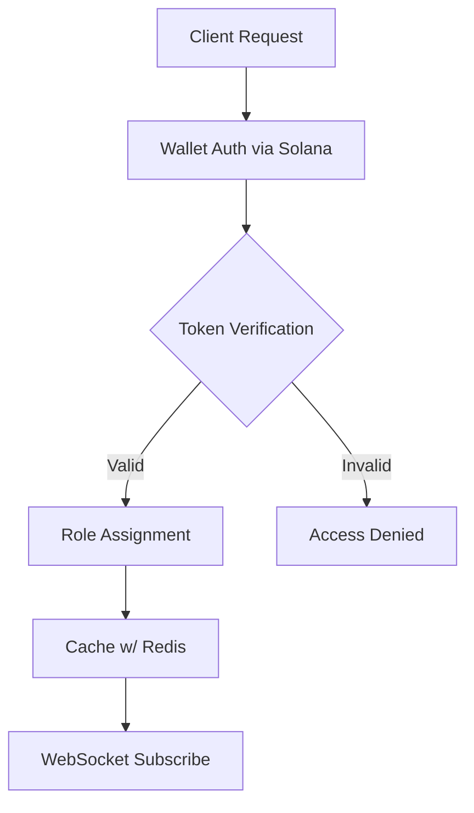
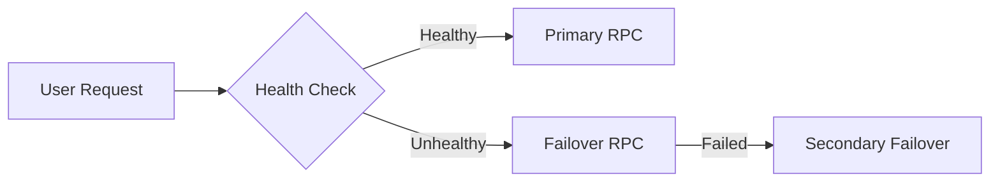
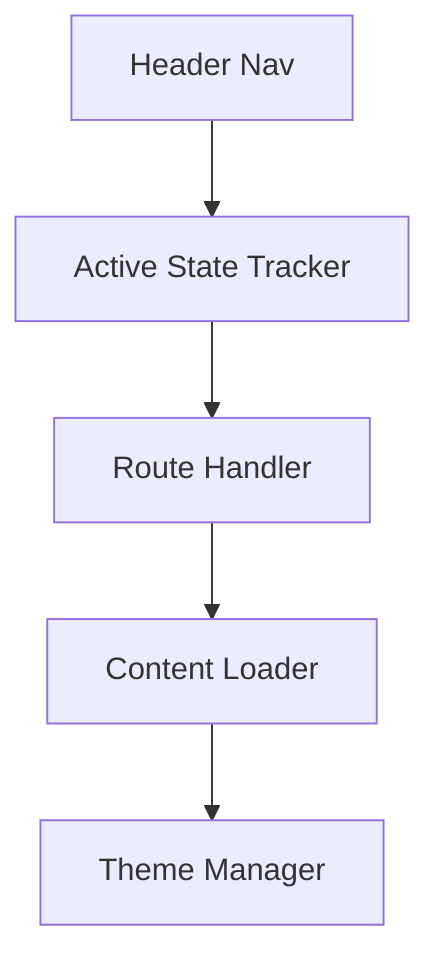

# System Architecture Overview
Latest Update: 2025-02-16 18:30 UTC

## Core Architecture Decisions

### Token Gating Implementation

### Caching Strategy
- **Redis Layer**
  - 5-minute TTL for token balances
  - Session & role caching
  - WebSocket notifications for real-time updates

### RPC Management

### Navigation Architecture

## Integration Points
- **Solana** for on-chain token checks, real-time validation
- **Redis** for session caching, rate limiting, and WebSocket triggers

## Security Measures
1. Rate Limiting
   - Standard: 100/15min
   - Premium: 300/15min
   - IP-based checks
2. Authentication
   - Wallet signatures
   - Token-based gating
   - NFT validation

## Performance Optimizations
1. **Caching**: Minimizing RPC calls with a 5-minute TTL
2. **RPC Management**: Automatic failover, pooled connections
3. **WebSockets**: Real-time updates for token balances

## Development Guidelines
- **Feature-Based** directory structure
- **Centralized Config** for environment variables
- **Type-Safe Interfaces** to reduce runtime errors
- **Debug Toggles** for easier troubleshooting

## Future Considerations
- Horizontal scaling of Redis
- Additional AI-driven features for **rolodexter3**
- Potential decentralized storage integration

---
**Status Update (rolodexterVS)**:
- Architecture consistent with **rolodexter Labs, LLC** standards
- Minimizing friction between **rolodexterVS** (IDE agent) and production deployment

### Identities:
- **rolodexter3**: The website/application
- **rolodexterGPT**: Chat-based AI assistant
- **rolodexterVS**: IDE-based agent
- **rolodexter Labs, LLC**: Legal entity in California

Last Updated: 2025-02-16 18:30 UTC  
Signed by: **rolodexterGPT**