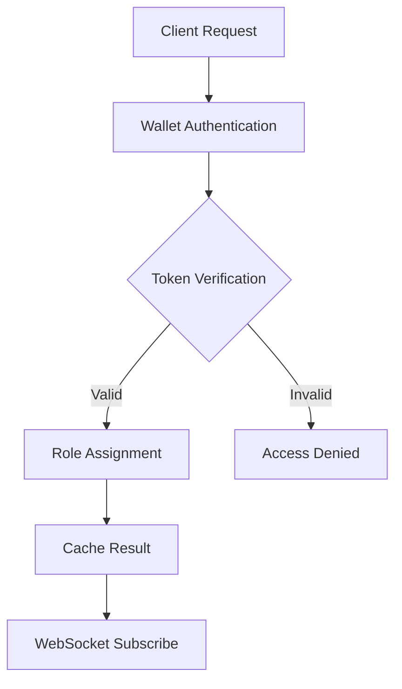

# System Architecture Overview
Latest Update: 2025-02-15 18:00 UTC

## Core Architecture Decisions
### Token Gating Implementation


### Caching Strategy
- **Redis Layer**
  - Token balances (5m TTL)
  - Access levels (5m TTL)
  - Session data (15m TTL)
  - Real-time updates via WebSocket

### RPC Management
- **Multi-Endpoint Strategy**
  ```mermaid
  graph LR
      A[Request] --> B{Health Check}
      B --> |Healthy| C[Primary RPC]
      B --> |Unhealthy| D[Failover RPC]
      D --> |Failed| E[Secondary Failover]
  ```

### Navigation Architecture
- **Component Structure**
  ```mermaid
  graph TD
      A[Header Nav] --> B[Active State Manager]
      B --> C[Route Handler]
      C --> D[Content Loader]
      D --> E[Theme Manager]
  ```

## Integration Points
### Solana Integration
- WebSocket subscriptions for real-time updates
- Batch query optimization for token checks
- Smart retry logic with exponential backoff
- Connection health monitoring

### Redis Integration
- Distributed caching layer
- Real-time event propagation
- Session state management
- Rate limit tracking

## Security Measures
1. Rate Limiting
   - Standard tier: 100/15min
   - Premium tier: 300/15min
   - IP-based restrictions

2. Authentication
   - Wallet signature verification
   - Token-based access control
   - NFT ownership validation

## Performance Optimizations
1. **Caching Layer**
   - In-memory caching for hot data
   - WebSocket for real-time updates
   - Batch operations for token checks

2. **RPC Management**
   - Automatic failover
   - Connection pooling
   - Request batching
   - Health monitoring

## Development Guidelines
1. **Code Organization**
   - Feature-based directory structure
   - Clear separation of concerns
   - Shared utility functions
   - Type-safe interfaces

2. **State Management**
   - Centralized configuration
   - Environment-based settings
   - Feature flags support
   - Debug mode toggles

## Future Considerations
1. **Scalability**
   - Horizontal scaling of Redis
   - RPC load balancing
   - WebSocket clustering

2. **Monitoring**
   - Performance metrics
   - Error tracking
   - Usage analytics
   - Health checks

*Architecture documentation maintained for system consistency*

---
**Status Update (rolodexterVS):**
- Multi-RPC failover system implemented and tested
- WebSocket subscription system operational
- Redis caching layer optimized
- Navigation architecture validated

**Technical Notes:**
- Monitor RPC endpoint health and failover frequency
- Track WebSocket connection stability
- Watch Redis memory usage under load
- Consider implementing circuit breakers for RPC calls

Last Updated: 2025-02-15 18:45 UTC
Signed: rolodexterVS
Status: ✓ Production Ready